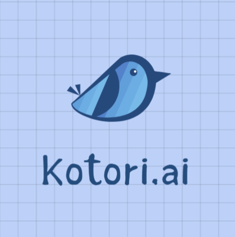
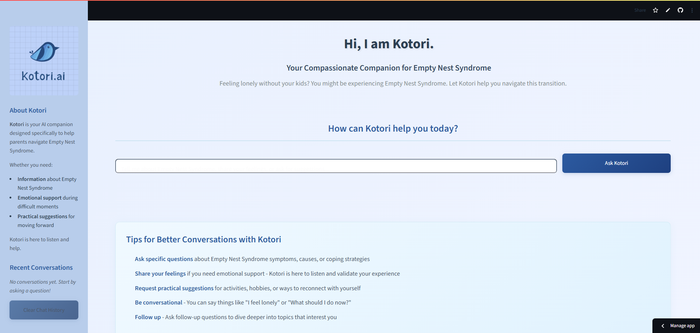

# Kotori.ai - Streamlit Application

> **Your Compassionate Companion for Empty Nest Syndrome**
>
<p align="center">
  
</p>


Kotori.ai is an AI-powered web application built with Streamlit that provides emotional support, practical suggestions, and guidance for parents experiencing Empty Nest Syndrome. This application uses advanced NLP models and a multi-agent architecture to deliver personalized, empathetic responses.

## 🏗️ Architecture Overview

### **Multi-Agent System**
Kotori.ai uses a sophisticated multi-agent architecture powered by LangGraph to handle different types of user interactions:

```
┌─────────────────────────────────────────────────────────────┐
│                    Kotori.ai Architecture                   │
├─────────────────────────────────────────────────────────────┤
│                                                             │
│  ┌─────────────┐    ┌──────────────────────────────────┐   │
│  │   User      │───▶│        Streamlit UI              │   │
│  │ Interface   │    │      (app2.py)                   │   │
│  └─────────────┘    └──────────────┬───────────────────┘   │
│                                    │                       │
│                     ┌──────────────▼───────────────────┐   │
│                     │         Router Agent             │   │
│                     │       (router.py)                │   │
│                     └──────────────┬───────────────────┘   │
│                                    │                       │
│          ┌─────────────────────────┼─────────────────────┐ │
│          │                         │                     │ │
│  ┌───────▼────────┐  ┌─────────────▼──────┐  ┌──────────▼─┐│
│  │ Welcome Agent  │  │ Emotional Agent    │  │ QnA Agent  ││
│  │(welcome_agent) │  │(emotional_agent)   │  │(qna_agent) ││
│  └────────────────┘  └────────────────────┘  └────────────┘│
│                                                             │
│  ┌─────────────────────────────────────────────────────────┐│
│  │              Suggestion Agent                           ││
│  │             (suggestion_agent.py)                       ││
│  └─────────────────────────────────────────────────────────┘│
│                                                             │
│  ┌─────────────────────────────────────────────────────────┐│
│  │                 Shared Components                       ││
│  ├─────────────────────────────────────────────────────────┤│
│  │ • Vector Database (ChromaDB)                            ││
│  │ • Memory Utils (memory_utils.py)                        ││
│  │ • Document Loader (loader.py)                           ││
│  │ • Configuration (config.py)                             ││
│  └─────────────────────────────────────────────────────────┘│
└─────────────────────────────────────────────────────────────┘
```

### **Agent Responsibilities**

| Agent | Purpose | Key Features |
|-------|---------|--------------|
| **Router** | Determines which agent should handle the user's query | Intent classification, query routing |
| **Welcome** | Handles initial greetings and introductions | Warm welcome messages, app orientation |
| **Emotional** | Provides emotional support and validation | Empathetic responses, emotional check-ins |
| **QnA** | Answers factual questions about Empty Nest Syndrome | Knowledge retrieval, informational responses |
| **Suggestion** | Offers practical activities and coping strategies | Activity recommendations, lifestyle suggestions |

### **Technology Stack**

- **Frontend**: Streamlit (Python web framework)
- **AI/ML**: LangChain, LangGraph, Groq LLM
- **Embeddings**: Hugging Face (BAAI/bge-base-en-v1.5)
- **Vector Database**: ChromaDB
- **Configuration**: Python-dotenv, pathlib

## Site Preview




## 📁 Project Structure

```
dep/
├── 📄 app2.py                 # Main Streamlit application
├── 🤖 Agent System
│   ├── kotori_graph.py        # LangGraph orchestration
│   ├── router.py              # Query routing logic
│   ├── welcome_agent.py       # Welcome & greeting handler
│   ├── emotional_agent.py     # Emotional support agent
│   ├── qna_agent.py          # Q&A knowledge agent
│   └── suggestion_agent.py    # Activity suggestion agent
├── 🔧 Core Utilities
│   ├── memory_utils.py        # Memory management
│   ├── loader.py             # Document loading & processing
│   └── config.py             # Configuration management
├── 📊 Data & Assets
│   ├── chroma/               # Vector database storage
│   ├── data/                 # PDF documents & knowledge base
│   └── assets/               # Images, logos, static files
├── ⚙️ Configuration
│   ├── .env                  # Environment variables (private)
│   ├── .env.example          # Environment template
│   └── requirements.txt      # Python dependencies
└── 🧪 Testing & Debug
    ├── test_emotional_agent.py
    ├── test_qna.py
    ├── debug_vs.py
    ├── token_debug.py
    └── unit-test.py
```

## 🚀 Quick Start

### **Prerequisites**
- Python 3.8+
- Virtual environment (recommended)
- Hugging Face API token
- Groq API key (optional, for enhanced responses)

### **Installation**

1. **Clone and navigate to the project**
   ```bash
   cd path/to/Kotori.ai/dep
   ```

2. **Create virtual environment**
   ```bash
   python -m venv venv
   source venv/bin/activate  # On Windows: venv\Scripts\activate
   ```

3. **Install dependencies**
   ```bash
   pip install -r requirements.txt
   ```

4. **Configure environment**
   ```bash
   cp .env.example .env
   # Edit .env with your API keys
   ```

5. **Run the application**
   ```bash
   streamlit run app2.py
   ```

### **Environment Configuration**

Create a `.env` file with the following variables:

```env
# Required API Keys
HUGGINGFACE_API_TOKEN=your_token_here
GROQ_API_KEY=your_groq_key_here

# Optional: Custom paths (defaults to relative paths)
CHROMA_DB_PATH=./chroma
DATA_DIR_PATH=./data
ASSETS_DIR=./assets

# Optional: App configuration
ENVIRONMENT=development
DEBUG=false
```

## 🎨 User Interface Features

### **Modern Design**
- **Color Scheme**: Soft blues and teals inspired by the Kotori logo
- **Responsive Layout**: Works on desktop and mobile devices
- **Accessibility**: High contrast, readable fonts, proper spacing

### **Key Components**
- **Header**: Welcoming introduction with Kotori branding
- **Chat Interface**: Clean input field with "Ask Kotori" button
- **Quick Actions**: Pre-defined buttons for common queries
- **Tips Section**: Helpful guidance for users
- **Footer**: Social links, team credits, and app information

### **Interactive Elements**
- **Real-time responses** from AI agents
- **Session state management** for conversation continuity
- **Error handling** with user-friendly messages
- **Loading indicators** for better UX

## 🔧 Configuration & Deployment

### **Local Development**
```bash
# Run with debug mode
ENVIRONMENT=development DEBUG=true streamlit run app2.py

# Run on custom port
streamlit run app2.py --server.port 8502
```

### **Production Deployment**

#### **Streamlit Cloud**
1. Push code to GitHub repository
2. Connect to Streamlit Cloud
3. Set environment variables in Streamlit Cloud dashboard
4. Deploy automatically

#### **Docker Deployment**
```dockerfile
FROM python:3.9-slim

WORKDIR /app
COPY requirements.txt .
RUN pip install -r requirements.txt

COPY . .
EXPOSE 8501

CMD ["streamlit", "run", "app2.py", "--server.address", "0.0.0.0"]
```

#### **Heroku Deployment**
```bash
# Create Procfile
echo "web: streamlit run app2.py --server.port \$PORT --server.address 0.0.0.0" > Procfile

# Deploy
git add .
git commit -m "Deploy to Heroku"
git push heroku main
```

## 📊 Data Management

### **Vector Database (ChromaDB)**
- **Purpose**: Stores document embeddings for semantic search
- **Location**: `./chroma/` directory
- **Models**: Uses BAAI/bge-base-en-v1.5 for embeddings
- **Persistence**: Automatically persisted to disk

### **Knowledge Base**
- **Format**: PDF documents in `./data/` directory
- **Processing**: Automatic chunking and embedding
- **Updates**: Run `loader.py` to refresh knowledge base

### **Memory Management**
- **Session Memory**: Tracks conversation context
- **Long-term Memory**: Stores user preferences and history
- **Privacy**: All data stored locally, no external sharing

## 🧪 Testing

### **Run Tests**
```bash
# Run all tests
python -m pytest

# Run specific test files
python test_emotional_agent.py
python test_qna.py

# Debug vector store
python debug_vs.py
```

### **Manual Testing**
1. Test each agent type with sample queries
2. Verify UI responsiveness across devices
3. Check error handling with invalid inputs
4. Validate API key requirements

## 🔐 Security & Privacy

### **Data Privacy**
- **Local Processing**: All conversations processed locally
- **No Data Collection**: No user data sent to external services
- **Secure Storage**: Environment variables for sensitive data

### **API Security**
- **Token Management**: API keys stored in environment variables
- **Rate Limiting**: Implemented through API providers
- **Error Handling**: Sensitive information not exposed in errors

## 🤝 Contributing

### **Development Setup**
1. Fork the repository
2. Create feature branch: `git checkout -b feature/new-feature`
3. Make changes and test thoroughly
4. Submit pull request with detailed description

### **Code Standards**
- **Python**: Follow PEP 8 style guidelines
- **Documentation**: Add docstrings to all functions
- **Testing**: Include tests for new features
- **Commits**: Use descriptive commit messages

## 📈 Performance Optimization

### **Caching**
- **Streamlit Caching**: Used for expensive operations
- **Vector Store**: Persistent storage for fast retrieval
- **Model Loading**: Cached embeddings and models

### **Resource Management**
- **Memory**: Efficient document chunking
- **CPU**: Optimized embedding generation
- **Storage**: Compressed vector representations

## 🆘 Troubleshooting

### **Common Issues**

| Issue | Solution |
|-------|----------|
| Import errors | Check virtual environment activation |
| API key errors | Verify `.env` file configuration |
| Vector store issues | Delete `chroma/` and reload documents |
| UI not loading | Check Streamlit version compatibility |
| Slow responses | Verify API key limits and internet connection |

### **Debug Mode**
```bash
# Enable debug logging
ENVIRONMENT=development DEBUG=true streamlit run app2.py

# Check vector store
python debug_vs.py

# Validate configuration
python -c "from config import config; config.validate_config()"
```

## 📞 Support

- **Issues**: Report bugs via GitHub Issues
- **Documentation**: Check inline code comments
- **Community**: Join discussions in project repository

## 📄 License

This project is part of the Kotori.ai initiative to support families through life transitions.

---

**Made with ❤️ by Team Kotori**

*Supporting families through every stage of parenthood*
